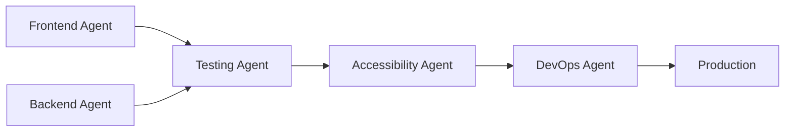

# ICD Website Multi-Agent Development Guide

## ⚠️ MANDATORY WORKFLOW - VIOLATIONS WILL BE REJECTED ⚠️

This document defines **REQUIRED** agent roles and workflows. See `WORKFLOW_ENFORCEMENT.md` for strict enforcement rules.

## Pre-Work Requirements (ALL AGENTS)

Before ANY work begins, you MUST:

1. **DECLARE YOUR ROLE**:
   ```
   "I am now operating as the [Agent Type] Agent"
   ```

2. **CREATE WORKTREE** (NEVER work on main):
   ```bash
   git worktree add ../wt-[agent] -b feat/[type]/[feature]
   cd ../wt-[agent]
   ```

3. **CONFIRM SCOPE**:
   ```
   "Working in: ../wt-[agent] on branch: feat/[type]/[feature]"
   "I will ONLY modify: [allowed paths]"
   ```

## Overview
This document defines specialized agent roles for developing and maintaining the ICD website. Each agent has specific responsibilities, workflows, and validation requirements to ensure high-quality, coordinated development.

## Agent Roles & Responsibilities

### 1. Frontend Agent 🎨
**Purpose**: Handle all UI/UX development, component creation, and user-facing features.

**Responsibilities**:
- Implement responsive React/Next.js components
- Ensure brand compliance (colors, typography, design)
- Create interactive forms and user flows
- Optimize performance and bundle size
- Implement client-side validation

**Scope**:
- `/app/**` - Next.js pages and layouts
- `/components/**` - React components
- `/styles/**` - CSS and styling
- `/public/**` - Static assets
- `/lib/client/**` - Client-side utilities

**Validation Requirements**:
```bash
# Before any commit:
npm run lint          # ESLint must pass
npm run typecheck     # TypeScript must compile
npm run build         # Build must succeed
npm run test:unit     # Component tests must pass
npm run test:visual   # Visual regression tests
```

**Key Tasks**:
- Create `/app/waitlist/page.tsx` with form
- Update all CTAs linking to waitlist
- Implement form validation and error states
- Add loading/success/error UI states
- Ensure mobile responsiveness

### 2. Backend Agent 🔧
**Purpose**: Build API endpoints, handle data processing, and manage server-side logic.

**Responsibilities**:
- Design and implement API endpoints
- Handle form submissions and data validation
- Implement security measures (rate limiting, CORS)
- Manage database connections and queries
- Create email notification systems

**Scope**:
- `/api/**` - API routes
- `/lib/server/**` - Server-side utilities
- `/lib/db/**` - Database schemas and queries
- `/lib/email/**` - Email templates and sending
- `/.env*` - Environment configuration

**Validation Requirements**:
```bash
# Before any commit:
npm run lint          # ESLint for API files
npm run typecheck     # TypeScript validation
npm run test:api      # API integration tests
npm run test:db       # Database tests
```

**Key Tasks**:
- Create `/api/waitlist` endpoint
- Implement data validation middleware
- Set up database schema for waitlist entries
- Configure email notifications
- Add rate limiting and security headers

### 3. Testing Agent 🧪
**Purpose**: Ensure code quality through comprehensive testing at all levels.

**Responsibilities**:
- Write and maintain test suites
- Perform manual testing and validation
- Create visual regression tests
- Test accessibility compliance
- Performance testing and optimization

**Scope**:
- `/tests/**` - All test files
- `/__tests__/**` - Component tests
- `/e2e/**` - End-to-end tests
- `/.github/workflows/**` - CI/CD test configs

**Validation Requirements**:
```bash
# Comprehensive testing suite:
npm run test                    # All unit tests
npm run test:integration        # Integration tests
npm run test:e2e               # End-to-end tests
npm run test:accessibility     # A11y compliance
npm run test:performance       # Performance metrics
npm run test:coverage          # Coverage > 80%
```

**Key Tasks**:
- Create waitlist form submission tests
- Test error states and edge cases
- Verify accessibility standards
- Performance test the waitlist flow
- Cross-browser compatibility testing

### 4. DevOps Agent 🚀
**Purpose**: Handle deployment, infrastructure, and production operations.

**Responsibilities**:
- Configure deployment pipelines
- Manage environment variables
- Set up monitoring and logging
- Handle production deployments
- Database migrations and backups

**Scope**:
- `/.github/workflows/**` - GitHub Actions
- `/infrastructure/**` - Infrastructure as Code
- `/scripts/**` - Deployment scripts
- `docker-compose.yml` - Container configs
- Production environment management

**Validation Requirements**:
```bash
# Pre-deployment checklist:
npm run build:prod              # Production build
npm run test:all               # All tests pass
npm run audit                  # Security audit
npm run lighthouse             # Performance audit
```

**Key Tasks**:
- Set up backend hosting (Vercel/Railway/etc)
- Configure environment variables
- Create deployment pipeline for backend
- Set up database hosting
- Configure monitoring and alerts

### 5. Accessibility Agent ♿
**Purpose**: Ensure WCAG compliance and universal usability.

**Responsibilities**:
- Audit color contrast ratios
- Test keyboard navigation
- Verify screen reader compatibility
- Ensure proper ARIA labels
- Mobile accessibility testing

**Scope**:
- All user-facing components
- Form interactions
- Navigation elements
- Error messages and alerts
- Loading states

**Validation Requirements**:
```bash
# Accessibility validation:
npm run test:a11y              # Automated a11y tests
npm run audit:contrast         # Color contrast check
npm run audit:keyboard         # Keyboard navigation
# Manual screen reader testing required
```

**Key Tasks**:
- Audit waitlist form accessibility
- Test with screen readers
- Verify keyboard navigation
- Check focus management
- Ensure error announcements

## Workflow Coordination

### 1. Feature Implementation Flow


### 2. Waitlist Implementation Plan

#### Phase 1: Backend Setup (Backend Agent)
1. Create API endpoint `/api/waitlist`
2. Set up database schema
3. Implement validation logic
4. Add rate limiting
5. Create email notification system

#### Phase 2: Frontend Implementation (Frontend Agent)
1. Create `/app/waitlist/page.tsx`
2. Build form component with validation
3. Implement success/error states
4. Update all CTA buttons
5. Add loading animations

#### Phase 3: Testing (Testing Agent)
1. Unit test all components
2. Integration test API endpoints
3. E2E test full user flow
4. Performance testing
5. Security testing

#### Phase 4: Accessibility (Accessibility Agent)
1. Audit form accessibility
2. Test keyboard navigation
3. Verify screen reader support
4. Check mobile accessibility
5. Validate error handling

#### Phase 5: Deployment (DevOps Agent)
1. Set up backend hosting
2. Configure environment variables
3. Deploy backend services
4. Update frontend deployment
5. Monitor production metrics

## Communication Protocol

### Status Updates
Each agent MUST provide updates using this EXACT format:
```
[AGENT_NAME] Status Update:
✅ Completed: [list of completed tasks]
🔄 In Progress: [current work]
⚠️ Blockers: [any issues]
📋 Next Steps: [planned work]
🏷️ Branch: [current branch name]
📁 Worktree: [worktree location]
```

### Handoff Requirements (MANDATORY)
When passing work between agents, create `HANDOFF_[FROM]_TO_[TO].md`:
```markdown
## Handoff from [CURRENT_AGENT] to [NEXT_AGENT]
Date: [ISO 8601 timestamp]

### Work Completed:
- [ ] Feature A implemented
- [ ] Tests written and passing
- [ ] Documentation updated

### Current State:
- Branch: feat/[type]/[feature]
- Worktree: ../wt-[agent]
- Last Commit: [hash] [conventional commit message]

### Validation Status:
- Tests: ✅ PASSING / ❌ FAILING
- Lint: ✅ PASSING / ❌ FAILING  
- Build: ✅ PASSING / ❌ FAILING
- A11y: ✅ PASSING / ❌ FAILING

### Files Modified:
- path/to/file1.tsx (added)
- path/to/file2.ts (modified)

### Next Steps Required:
1. [Specific action needed]
2. [Another specific action]

### Known Issues:
- [Issue description and impact]
```

### Validation Gates
Before moving to the next phase:
- **Frontend → Testing**: All components render without errors
- **Backend → Testing**: All endpoints return expected responses
- **Testing → Accessibility**: 80% test coverage achieved
- **Accessibility → DevOps**: WCAG AA compliance verified
- **DevOps → Production**: All environments tested

## Conventional Commits (MANDATORY)

### Format: `<type>(<scope>): <subject>`

All commits MUST follow this format or they will be REJECTED.

### Allowed Types:
- `feat`: New feature
- `fix`: Bug fix
- `docs`: Documentation only changes
- `style`: Formatting, missing semicolons, etc
- `refactor`: Code change that neither fixes nor adds feature
- `perf`: Performance improvements
- `test`: Adding missing tests
- `chore`: Changes to build process or auxiliary tools

### Required Scopes:
- `waitlist`: Waitlist feature
- `api`: Backend API
- `ui`: Frontend components
- `auth`: Authentication
- `db`: Database
- `deploy`: Deployment
- `a11y`: Accessibility
- `test`: Testing

### Examples:
```bash
# ✅ CORRECT
git commit -m "feat(waitlist): add email validation to signup form"
git commit -m "fix(ui): correct button contrast ratio for WCAG"
git commit -m "test(api): add integration tests for waitlist endpoint"
git commit -m "perf(db): add index to waitlist email column"
git commit -m "chore(deploy): update GitHub Actions workflow"

# ❌ INCORRECT - WILL BE REJECTED
git commit -m "fix: add waitlist page"          # Missing scope
git commit -m "Fixed waitlist bug"              # Not conventional format
git commit -m "feat add validation"             # Missing colon and parentheses
git commit -m "update code"                     # Too vague, wrong format
```

### Multi-line Commit Format:
```bash
git commit -m "feat(waitlist): implement email verification flow

- Add verification token generation
- Create email template for verification
- Implement token validation endpoint
- Add 24-hour expiration for tokens

Closes #123"
```

## Environment Configuration

### Local Development
```bash
# Frontend Agent
npm run dev                    # Start dev server
npm run storybook             # Component development

# Backend Agent
npm run dev:api               # Start API server
npm run db:migrate            # Run migrations

# Testing Agent
npm run test:watch            # Watch mode testing
npm run cy:open              # Cypress UI

# All Agents
npm run validate              # Run all checks
```

### Branch Strategy
```
main                          # Production code
├── feat/waitlist-backend    # Backend Agent work
├── feat/waitlist-frontend   # Frontend Agent work
├── test/waitlist-coverage   # Testing Agent work
└── fix/waitlist-a11y        # Accessibility fixes
```

## Quality Gates

### Definition of Done
A feature is complete when:
- [ ] All acceptance criteria met
- [ ] Unit tests written and passing
- [ ] Integration tests passing
- [ ] Accessibility audit passing
- [ ] Performance benchmarks met
- [ ] Security review completed
- [ ] Documentation updated
- [ ] Code reviewed and approved
- [ ] Deployed to staging
- [ ] Stakeholder approval received

### Performance Targets
- **Page Load**: < 3s on 3G
- **Time to Interactive**: < 5s
- **API Response**: < 200ms p95
- **Error Rate**: < 0.1%
- **Accessibility Score**: 100

## Troubleshooting Guide

### Common Issues

1. **Build Failures**
   - Check Node version (v18+)
   - Clear cache: `rm -rf .next node_modules`
   - Reinstall: `npm ci`

2. **Test Failures**
   - Check test environment setup
   - Verify mock data is current
   - Run single test for debugging

3. **Deployment Issues**
   - Verify environment variables
   - Check build logs
   - Test in staging first

## Agent-Specific Commands

### Frontend Agent
```bash
# Development
npm run dev
npm run build
npm run test:components

# Validation
npm run lint:fix
npm run format
npm run typecheck
```

### Backend Agent
```bash
# Development
npm run dev:api
npm run db:seed
npm run db:migrate

# Validation
npm run test:api
npm run test:db
npm run lint:api
```

### Testing Agent
```bash
# Testing
npm run test:all
npm run test:watch
npm run test:coverage
npm run e2e
npm run e2e:headed
```

### DevOps Agent
```bash
# Deployment
npm run build:prod
npm run deploy:staging
npm run deploy:prod
npm run rollback
```

### Accessibility Agent
```bash
# Auditing
npm run audit:a11y
npm run audit:contrast
npm run audit:performance
npm run lighthouse
```

## Conclusion

This multi-agent approach ensures:
- **Separation of Concerns**: Each agent focuses on their expertise
- **Quality Assurance**: Multiple validation layers
- **Efficient Development**: Parallel work streams
- **Comprehensive Coverage**: All aspects of development addressed

Remember: **Communication and coordination are key to success!**